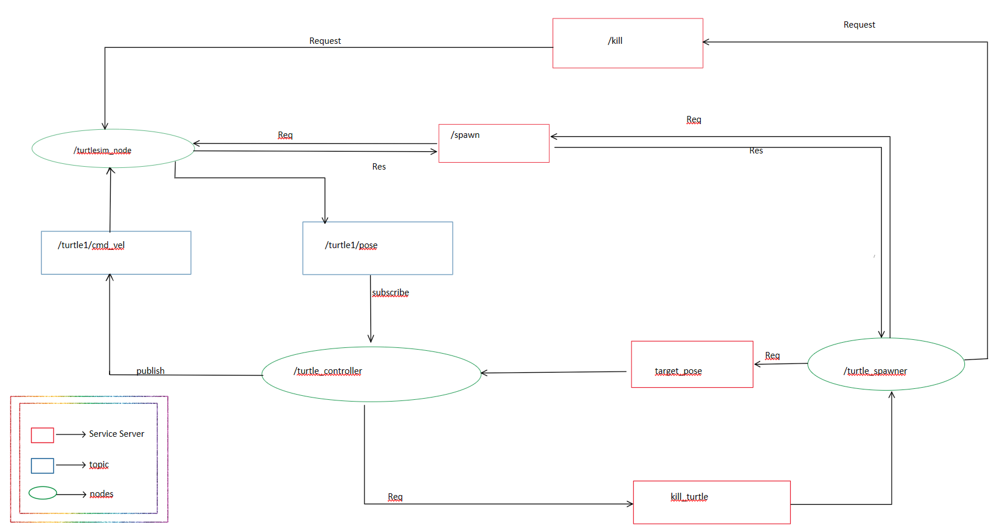

# Turtle Carnage Game

Welcome to the **Turtle Carnage** game repository! 🐢🚀

## Overview

In this game, turtles engage in relentless pursuit, chasing, and outwitting each other. The main components include:

1. **turtlesim_node**: The environment where our turtle characters reside.
2. **turtle_spawner**: Responsible for spawning new turtles with random positions and orientations.
3. **turtle_controller**: Manages the movement and behavior of the turtles.

## Workflow

Here's how the game unfolds:

1. **Spawn New Turtles**:
   - The `turtle_spawner` node generates random positions (x, y) and orientations (θ) for new turtles.
   - It sends a spawn request to the `/Spawn` service, creating a fresh turtle.

2. **Target Setting**:
   - The `turtle_spawner` node also communicates with the `/target_pose` server.
   - It sets the target turtle's name and position.

3. **Control Loop**:
   - The `turtle_controller` node runs a control loop at 0.1Hz.
   - It calculates linear and angular velocities based on the target position.
   - These velocities are published to the `/cmd_vel` topic.

4. **Chase and Capture**:
   - The turtle moves toward the target.
   - Once it reaches within a clearance of 0.25 units, it stops moving.

5. **Target Elimination**:
   - The `turtle_controller` node sends a kill request to the `/kill_turtle` server.
   - The target turtle is eliminated.

6. **Repeat**:
   - The `turtle_spawner` node receives the client registration.
   - It sends a client request to the `/kill` service of the `turtlesim_node`.
   - A new target turtle is spawned, and the cycle continues.

## Node-Communications-Map


https://github.com/Abhi-0212000/Turtle-Carnage/assets/70425157/9b7586b9-d526-464d-abfd-8b6a01dab577

## Software Requirements
- Ubuntu 22.04
- ROS2 Humble
- Python 3.10

## Environment Setup
1. Create a ROS2 workspace:
   ```bash
   mkdir ros2_ws
   cd ros2_ws
   mkdir src
   colcon build

2. If colcon is not installed, run:
   ```bash
    sudo apt update
    sudo apt install python3-colcon-common-extensions
3. Add the ROS2 workspace to your ~/.bashrc:
   ```bash
    echo "source ~/ros2_ws/install/setup.bash" >> ~/.bashrc
    source ~/.bashrc

## Organize Your Folders
Place the following folders inside the `src` folder:
- `turtle_carnage`
- `my_robot_interfaces`
- `my_robot_bringup`


## Build Your Workspace
```bash
  cd ros2_ws
  colcon build
  source ~/.bashrc
```
## Launch Your Turtle Carnage App
```bash
cd
ros2 launch my_robot_bringup turtle_carnage_app.launch.py
```

Feel free to explore the code and have fun with the turtles! 🐢🎮
